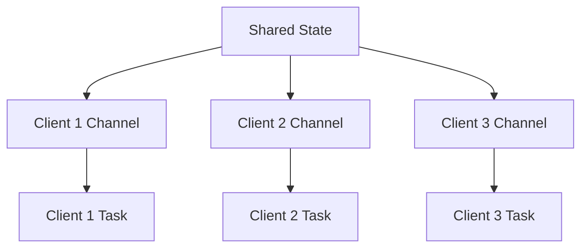

The chat server example demonstrates how to build a real-time application with Tokio that broadcasts messages between multiple connected clients. This is a more advanced example that showcases shared state management, channels, and concurrent message handling.

## What You'll Learn

<CardGroup cols={2}>
  <Card title="Message Broadcasting" icon="tower-broadcast">
    Send messages from one client to all others
  </Card>
  
  <Card title="Shared State" icon="database">
    Manage connections with Arc and Mutex
  </Card>
  
  <Card title="Channels" icon="arrow-right-arrow-left">
    Use mpsc channels for task communication
  </Card>
  
  <Card title="tokio::select!" icon="code-branch">
    Handle multiple async operations concurrently
  </Card>
</CardGroup>

## Running the Example

<Steps>
  <Step title="Start the chat server">
    ```bash
    cargo run --example chat
    ```
    
    The server listens on `127.0.0.1:6142` by default.
  </Step>
  
  <Step title="Connect first client">
    In another terminal, connect using telnet:
    
    ```bash
    telnet localhost 6142
    ```
    
    Enter a username when prompted.
  </Step>
  
  <Step title="Connect more clients">
    Open additional terminals and connect more clients. Each should enter a unique username.
  </Step>
  
  <Step title="Chat away!">
    Type messages in any client. They'll be broadcast to all other connected clients.
  </Step>
</Steps>

<Note>
  Lines are delimited by `\r\n` because we're using telnet clients. The server uses `LinesCodec` to handle this automatically.
</Note>

## Complete Code

```rust
//! A chat server that broadcasts a message to all connections.
//!
//! This example is explicitly more verbose than it has to be. This is to
//! illustrate more concepts.
//!
//! A chat server for telnet clients. After a telnet client connects, the first
//! line should contain the client's name. After that, all lines sent by a
//! client are broadcasted to all other connected clients.
//!
//! Because the client is telnet, lines are delimited by "\r\n".
//!
//! You can test this out by running:
//!
//!     cargo run --example chat
//!
//! And then in another terminal run:
//!
//!     telnet localhost 6142
//!
//! You can run the `telnet` command in any number of additional windows.
//!
//! You can run the second command in multiple windows and then chat between the
//! two, seeing the messages from the other client as they're received. For all
//! connected clients they'll all join the same room and see everyone else's
//! messages.

#![warn(rust_2018_idioms)]

use tokio::net::{TcpListener, TcpStream};
use tokio::sync::{mpsc, Mutex};
use tokio_stream::StreamExt;
use tokio_util::codec::{Framed, LinesCodec};

use futures::SinkExt;
use std::collections::HashMap;
use std::env;
use std::error::Error;
use std::io;
use std::net::SocketAddr;
use std::sync::Arc;

const DEFAULT_ADDR: &str = "127.0.0.1:6142";

#[tokio::main]
async fn main() -> Result<(), Box<dyn Error>> {
    use tracing_subscriber::{fmt::format::FmtSpan, EnvFilter};
    // Configure a `tracing` subscriber that logs traces emitted by the chat
    // server.
    tracing_subscriber::fmt()
        // Filter what traces are displayed based on the RUST_LOG environment
        // variable.
        //
        // Traces emitted by the example code will always be displayed. You
        // can set `RUST_LOG=tokio=trace` to enable additional traces emitted by
        // Tokio itself.
        .with_env_filter(EnvFilter::from_default_env().add_directive("chat=info".parse()?))
        // Log events when `tracing` spans are created, entered, exited, or
        // closed. When Tokio's internal tracing support is enabled (as
        // described above), this can be used to track the lifecycle of spawned
        // tasks on the Tokio runtime.
        .with_span_events(FmtSpan::FULL)
        // Set this subscriber as the default, to collect all traces emitted by
        // the program.
        .init();

    // Create the shared state. This is how all the peers communicate.
    //
    // The server task will hold a handle to this. For every new client, the
    // `state` handle is cloned and passed into the task that processes the
    // client connection.
    let state = Arc::new(Mutex::new(Shared::new()));

    let addr = env::args()
        .nth(1)
        .unwrap_or_else(|| DEFAULT_ADDR.to_string());

    // Bind a TCP listener to the socket address.
    //
    // Note that this is the Tokio TcpListener, which is fully async.
    let listener = TcpListener::bind(&addr).await?;

    tracing::info!("server running on {addr}");

    loop {
        // Asynchronously wait for an inbound TcpStream.
        let (stream, addr) = listener.accept().await?;

        // Clone a handle to the `Shared` state for the new connection.
        let state = Arc::clone(&state);

        // Spawn our handler to be run asynchronously.
        tokio::spawn(async move {
            tracing::debug!("accepted connection from {addr}");
            if let Err(e) = process(state, stream, addr).await {
                tracing::warn!("Connection from {addr} failed: {e:?}");
            }
        });
    }
}

/// Shorthand for the transmit half of the message channel.
type Tx = mpsc::UnboundedSender<String>;

/// Shorthand for the receive half of the message channel.
type Rx = mpsc::UnboundedReceiver<String>;

/// Data that is shared between all peers in the chat server.
///
/// This is the set of `Tx` handles for all connected clients. Whenever a
/// message is received from a client, it is broadcasted to all peers by
/// iterating over the `peers` entries and sending a copy of the message on each
/// `Tx`.
struct Shared {
    peers: HashMap<SocketAddr, Tx>,
}

/// The state for each connected client.
struct Peer {
    /// The TCP socket wrapped with the `Lines` codec, defined below.
    ///
    /// This handles sending and receiving data on the socket. When using
    /// `Lines`, we can work at the line level instead of having to manage the
    /// raw byte operations.
    lines: Framed<TcpStream, LinesCodec>,

    /// Receive half of the message channel.
    ///
    /// This is used to receive messages from peers. When a message is received
    /// off of this `Rx`, it will be written to the socket.
    rx: Rx,
}

impl Shared {
    /// Create a new, empty, instance of `Shared`.
    fn new() -> Self {
        Shared {
            peers: HashMap::new(),
        }
    }

    /// Send a `LineCodec` encoded message to every peer, except
    /// for the sender.
    ///
    /// This function also cleans up disconnected peers automatically.
    async fn broadcast(&mut self, sender: SocketAddr, message: &str) {
        let mut failed_peers = Vec::new();
        let message = message.to_string(); // Clone once for all sends

        for (addr, tx) in self.peers.iter() {
            if *addr != sender && tx.send(message.clone()).is_err() {
                // Receiver has been dropped, mark for removal
                failed_peers.push(*addr);
            }
        }

        // Clean up disconnected peers
        for addr in failed_peers {
            self.peers.remove(&addr);
            tracing::debug!("Removed disconnected peer: {addr}");
        }
    }
}

impl Peer {
    /// Create a new instance of `Peer`.
    async fn new(
        state: Arc<Mutex<Shared>>,
        lines: Framed<TcpStream, LinesCodec>,
    ) -> io::Result<Peer> {
        // Get the client socket address
        let addr = lines.get_ref().peer_addr()?;

        // Create a channel for this peer
        let (tx, rx) = mpsc::unbounded_channel();

        // Add an entry for this `Peer` in the shared state map.
        state.lock().await.peers.insert(addr, tx);

        Ok(Peer { lines, rx })
    }
}

/// Process an individual chat client
async fn process(
    state: Arc<Mutex<Shared>>,
    stream: TcpStream,
    addr: SocketAddr,
) -> Result<(), Box<dyn Error>> {
    let mut lines = Framed::new(stream, LinesCodec::new());

    // Send a prompt to the client to enter their username.
    lines.send("Please enter your username:").await?;

    // Read the first line from the `LineCodec` stream to get the username.
    let Some(Ok(username)) = lines.next().await else {
        // We didn't get a line so we return early here.
        tracing::error!("Failed to get username from {addr}. Client disconnected.");
        return Ok(());
    };

    // Register our peer with state which internally sets up some channels.
    let mut peer = Peer::new(state.clone(), lines).await?;

    // A client has connected, let's let everyone know.
    {
        let mut state = state.lock().await;
        let msg = format!("{username} has joined the chat");
        tracing::info!("{msg}");
        state.broadcast(addr, &msg).await;
    }

    // Process incoming messages until our stream is exhausted by a disconnect.
    loop {
        tokio::select! {
            // A message was received from a peer. Send it to the current user.
            Some(msg) = peer.rx.recv() => {
                if let Err(e) = peer.lines.send(&msg).await {
                    tracing::error!("Failed to send message to {username}: {e:?}");
                    break;
                }
            }
            result = peer.lines.next() => match result {
                // A message was received from the current user, we should
                // broadcast this message to the other users.
                Some(Ok(msg)) => {
                    let mut state = state.lock().await;
                    let msg = format!("{username}: {msg}");

                    state.broadcast(addr, &msg).await;
                }
                // An error occurred.
                Some(Err(e)) => {
                    tracing::error!(
                        "an error occurred while processing messages for {username}; error = {e:?}"
                    );
                    break;
                }
                // The stream has been exhausted.
                None => break,
            },
        }
    }

    // If this section is reached it means that the client was disconnected!
    // Let's let everyone still connected know about it.
    {
        let mut state = state.lock().await;
        state.peers.remove(&addr);

        let msg = format!("{username} has left the chat");
        tracing::info!("{msg}");
        state.broadcast(addr, &msg).await;
    }

    Ok(())
}
```

## Architecture Overview

The chat server uses a hub-and-spoke architecture:



Each client has:
1. A spawned task handling its connection
2. An mpsc channel for receiving broadcasts
3. An entry in the shared `HashMap` of peers

## Key Concepts

### Shared State with Arc and Mutex

```rust
let state = Arc::new(Mutex::new(Shared::new()));
```

- **`Arc`** (Atomic Reference Counting) - Allows multiple tasks to own the same data
- **`Mutex`** - Ensures only one task can access the data at a time
- **`Shared`** - Contains the `HashMap` of connected peers

<Note>
  Tokio's `Mutex` is async-aware, unlike `std::sync::Mutex`. Always use `tokio::sync::Mutex` in async code.
</Note>

### Message Channels

```rust
type Tx = mpsc::UnboundedSender<String>;
type Rx = mpsc::UnboundedReceiver<String>;
```

Each client gets a channel pair:
- **Tx** (Transmitter) - Stored in shared state for broadcasting
- **Rx** (Receiver) - Owned by the client task to receive messages

### Broadcasting Messages

```rust
async fn broadcast(&mut self, sender: SocketAddr, message: &str) {
    for (addr, tx) in self.peers.iter() {
        if *addr != sender {
            tx.send(message.clone()).ok();
        }
    }
}
```

When a client sends a message:
1. The message is formatted with the username
2. The shared state is locked
3. The message is sent to all other clients' channels
4. Failed sends indicate disconnected clients

### The tokio::select! Macro

```rust
tokio::select! {
    Some(msg) = peer.rx.recv() => {
        // Message from another client
        peer.lines.send(&msg).await?;
    }
    result = peer.lines.next() => {
        // Message from this client
        state.broadcast(addr, &result?).await;
    }
}
```

`select!` concurrently waits on multiple async operations and runs the branch for whichever completes first.

<Tip>
  Think of `select!` like a switch statement for async operations. It's perfect for handling multiple input sources.
</Tip>

## Code Walkthrough

<Steps>
  <Step title="Initialize shared state">
    Create the shared state that all clients will use to communicate:
    
    ```rust
    let state = Arc::new(Mutex::new(Shared::new()));
    ```
  </Step>
  
  <Step title="Accept connections">
    For each new connection, clone the Arc handle and spawn a task:
    
    ```rust
    let (stream, addr) = listener.accept().await?;
    let state = Arc::clone(&state);
    tokio::spawn(async move {
        process(state, stream, addr).await
    });
    ```
  </Step>
  
  <Step title="Get username">
    The first line from each client is their username:
    
    ```rust
    lines.send("Please enter your username:").await?;
    let Some(Ok(username)) = lines.next().await else {
        return Ok(()); // Client disconnected
    };
    ```
  </Step>
  
  <Step title="Register peer">
    Create a channel and add the peer to shared state:
    
    ```rust
    let (tx, rx) = mpsc::unbounded_channel();
    state.lock().await.peers.insert(addr, tx);
    let peer = Peer { lines, rx };
    ```
  </Step>
  
  <Step title="Handle messages with select!">
    Use `select!` to handle both outgoing and incoming messages:
    
    ```rust
    tokio::select! {
        Some(msg) = peer.rx.recv() => {
            // Broadcast from another client
        }
        result = peer.lines.next() => {
            // Message from this client
        }
    }
    ```
  </Step>
  
  <Step title="Clean up on disconnect">
    When the client disconnects, remove them from shared state:
    
    ```rust
    state.lock().await.peers.remove(&addr);
    state.broadcast(addr, &format!("{username} has left")).await;
    ```
  </Step>
</Steps>

## Advanced Features

### Line-Based Framing

```rust
use tokio_util::codec::{Framed, LinesCodec};
let mut lines = Framed::new(stream, LinesCodec::new());
```

Instead of working with raw bytes, `LinesCodec` automatically:
- Splits incoming data by `\r\n`
- Frames outgoing data with `\r\n`
- Handles partial reads and buffering

### Automatic Peer Cleanup

```rust
if tx.send(message.clone()).is_err() {
    failed_peers.push(*addr);
}
```

When a client disconnects, its `Rx` half is dropped, causing `send()` to fail. The broadcast function automatically removes these dead peers.

### Tracing Integration

```rust
use tracing_subscriber::{fmt::format::FmtSpan, EnvFilter};

tracing::info!("server running on {addr}");
tracing::debug!("accepted connection from {addr}");
```

The example uses `tracing` for structured logging. Set `RUST_LOG=chat=debug` for verbose output.

## Common Patterns

### Safe Mutex Scoping

```rust
{
    let mut state = state.lock().await;
    state.broadcast(addr, &msg).await;
} // Lock is dropped here
```

Always use a scope block to ensure the mutex lock is dropped as soon as possible.

<Warning>
  Never hold a mutex lock across `.await` points unless absolutely necessary. This can cause deadlocks.
</Warning>

### Channel-Based Communication

```rust
let (tx, rx) = mpsc::unbounded_channel();
state.peers.insert(addr, tx);
```

Channels are the idiomatic way to communicate between tasks in Tokio. They're lock-free and efficient.

## Next Steps

<CardGroup cols={2}>
  <Card title="Echo Server" icon="server" href="/examples/echo-server">
    Review the simpler echo server pattern
  </Card>
  
  <Card title="Custom Executor" icon="gears" href="/examples/custom-executor">
    Learn advanced runtime integration
  </Card>
</CardGroup>

<Tip>
  Try extending the chat server:
  - Add private messaging between users
  - Implement chat rooms/channels
  - Add message history for new joiners
  - Implement username uniqueness checking
  - Add rate limiting per client
</Tip>